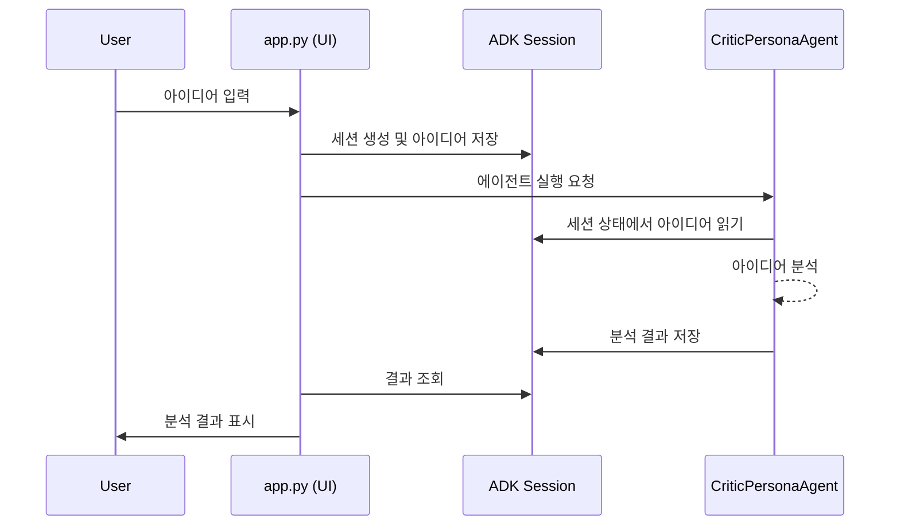
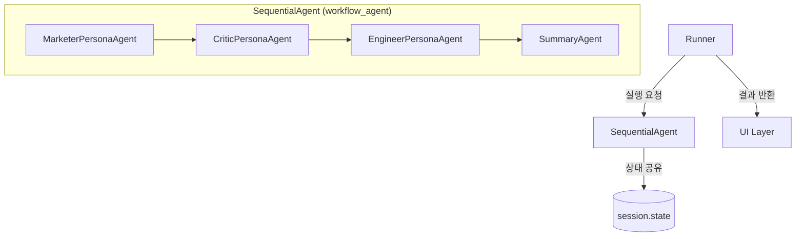
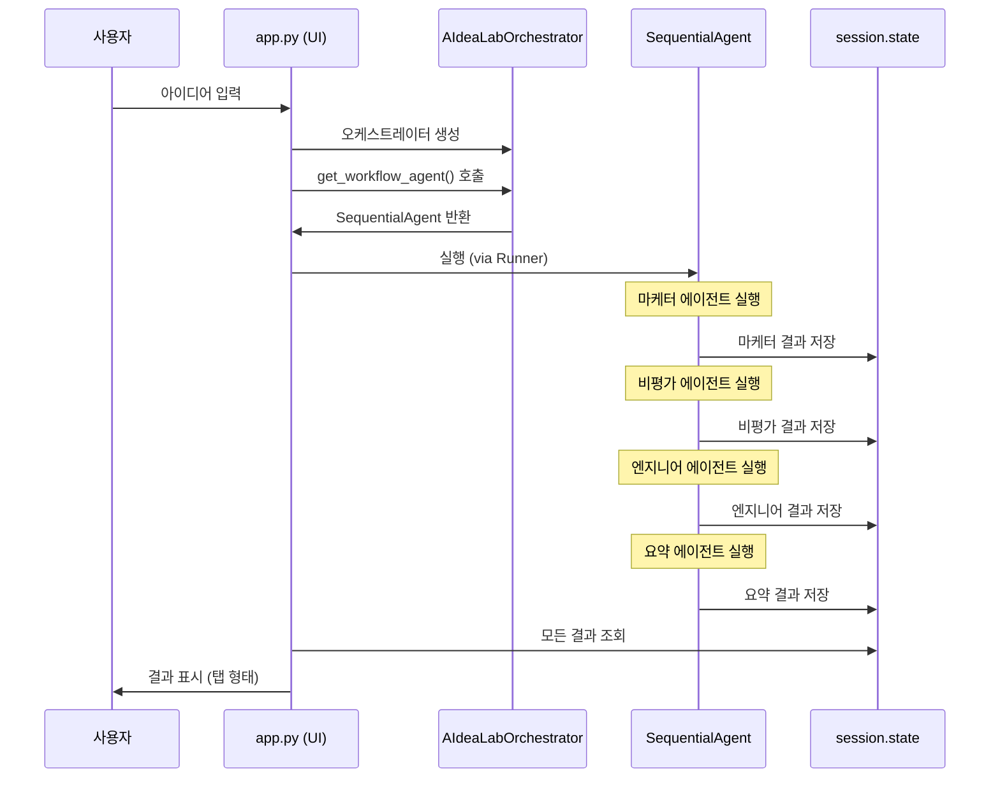

# AIdea Lab 아키텍처 설명서

## 프로젝트 구조

AIdea Lab은 다음과 같은 디렉토리 구조로 설계되었습니다:

```
aidea-lab/
│
├── src/                      # 소스 코드
│   ├── agents/               # AI 페르소나 에이전트 클래스
│   │   ├── critic_agent.py   # 비판적 분석가 페르소나 에이전트
│   │   ├── marketer_agent.py # 창의적 마케터 페르소나 에이전트
│   │   └── engineer_agent.py # 현실적 엔지니어 페르소나 에이전트
│   ├── orchestrator/         # 오케스트레이터 에이전트 클래스
│   │   └── main_orchestrator.py # 메인 오케스트레이터
│   ├── ui/                   # 사용자 인터페이스 코드
│   │   └── app.py            # Streamlit 기반 UI 애플리케이션
│   └── poc/                  # 개념 증명 (Proof of Concept) 코드
│       ├── simple_adk_agent.py      # 기본 ADK Agent 테스트
│       └── session_state_test_agent.py  # ADK session.state 테스트
│
├── config/                   # 설정 파일
│   ├── prompts.py            # 페르소나별 시스템 프롬프트 정의
│   ├── personas.py           # 페르소나 설정 및 매개변수 정의
│   └── models.py             # 제미니 모델 설정 및 선택 옵션 정의
│
├── tests/                    # 테스트 코드
│   ├── test_critic_agent.py  # 비판적 분석가 에이전트 테스트
│   └── test_app.py           # UI 애플리케이션 테스트
│
├── docs/                     # 문서
├── scripts/                  # 유틸리티 스크립트
└── .env                      # 환경 변수 설정 파일
```

## 핵심 구성 요소

### 1. config/prompts.py

이 파일은 다양한 AI 페르소나의 시스템 프롬프트를 정의합니다. 각 프롬프트는 해당 페르소나의 역할, 응답 스타일, 제공해야 할 정보를 상세히 설명합니다.

- **CRITIC_PROMPT**: 비판적 분석가 페르소나를 위한 시스템 프롬프트로, 아이디어의 문제점과 리스크를 분석합니다.
- **MARKETER_PROMPT**: 창의적 마케터 페르소나를 위한 시스템 프롬프트로, 아이디어의 창의적 가치와 시장 잠재력을 분석합니다.
- **ENGINEER_PROMPT**: 현실적 엔지니어 페르소나를 위한 시스템 프롬프트로, 아이디어의 기술적 실현 가능성을 분석합니다.
- **FINAL_SUMMARY_PROMPT**: 오케스트레이터가 최종 요약을 생성할 때 사용하는 프롬프트입니다.
- **DIALOGUE_SUMMARY_PROMPT**: (선택적) 대화 히스토리를 요약할 때 사용하는 프롬프트입니다.

### 2. config/personas.py

이 파일은 각 페르소나의 설정 및 매개변수를 정의합니다.

- **PersonaType**: 페르소나 유형을 정의하는 열거형 클래스입니다.
- **PERSONA_CONFIGS**: 각 페르소나별 구성 설정을 담고 있는 사전형 객체로, 이름, 설명, 아이콘, 온도(temperature), 최대 출력 토큰 수, 출력 키 등의 정보를 포함합니다.
- **ORCHESTRATOR_CONFIG**: 오케스트레이터 에이전트의 설정을 정의합니다.
- **PERSONA_SEQUENCE**: 워크숍 진행 순서를 정의하는 리스트입니다.
- **SELECTED_MODEL**: 현재 선택된 제미니 모델을 저장하는 전역 변수입니다. 기본값은 `DEFAULT_MODEL.value`로 설정되며, UI에서 모델 선택 시 이 값이 업데이트됩니다.

### 2-1. config/models.py

이 파일은 사용 가능한 제미니 모델과 모델 설정을 정의합니다.

- **역할**: 사용 가능한 제미니 모델과 모델 설정을 관리합니다.
- **아키텍처**:
    - `ModelType` Enum을 통해 사용 가능한 모델들의 ID 정의
    - `MODEL_CONFIGS` 사전을 통해 각 모델의 메타데이터(이름, 설명, 표시명) 관리
    - `DEFAULT_MODEL` 상수로 기본 모델 지정
    - `get_model_display_options()` 함수로 UI에 표시할 모델 옵션 목록 제공
    - 최신 제미니 모델 지원: Gemini 2.0 Flash, Gemini 2.5 Pro Preview 03-25, Gemini 2.5 Flash Preview 04-17, Gemini 2.5 Pro Preview 05-06

### 3. src/agents/critic_agent.py

비판적 분석가 페르소나 에이전트를 구현한 클래스 파일입니다. Google ADK의 Agent 클래스를 활용하여 비판적 분석가 역할을 수행하는 에이전트를 정의합니다.

- **CriticPersonaAgent 클래스**: 비판적 분석가 페르소나를 구현한 클래스입니다.
  - `__init__()`: 페르소나 설정과 프롬프트를 사용하여 에이전트를 초기화합니다.
  - `get_agent()`: 초기화된 Agent 객체를 반환합니다.
  - `get_output_key()`: 에이전트 응답이 세션 상태에 저장될 키를 반환합니다.

### 4. src/ui/app.py

Streamlit을 사용한 웹 기반 사용자 인터페이스를 구현한 파일입니다. 사용자가 아이디어를 입력하고 분석 결과를 확인할 수 있는 UI를 제공합니다.

- **역할**: Streamlit 기반의 사용자 인터페이스 (UI)를 제공합니다.
- **아키텍처**:
    - 사용자가 아이디어를 입력하고 분석을 요청하는 웹 애플리케이션의 진입점입니다.
    - `AIdeaLabOrchestrator`를 호출하여 아이디어 분석 프로세스를 시작합니다.
    - 각 페르소나(마케터, 비평가, 엔지니어)의 분석 결과와 최종 요약을 탭 형태로 사용자에게 보여줍니다.
    - 세션 관리를 통해 사용자별 분석 흐름을 유지합니다.
    - `asyncio`를 사용하여 백엔드 로직(에이전트 실행)을 비동기적으로 처리하여 UI 반응성을 유지합니다.
    - **모델 선택 기능**:
        - "고급 설정" expander 내에 모델 선택 드롭다운 UI 제공
        - 선택된 모델의 정보 표시 및 변경 적용 버튼 제공
        - `update_selected_model()` 함수를 통해 `personas.SELECTED_MODEL` 전역 변수 업데이트
        - 아이디어 분석 요청 시 선택된 모델 자동 적용

### 5. src/poc/simple_adk_agent.py

Google ADK의 기본 Agent 클래스를 사용하여 간단한 LLM 에이전트를 구현한 예제 코드입니다. 환경 변수에서 API 키를 로드하고, Google ADK Runner 클래스를 사용하여 에이전트를 실행하고 응답을 처리합니다.
- **특징**: 선택 가능한 모델을 사용하도록 수정되어 `config/personas.py`의 `SELECTED_MODEL` 변수를 참조합니다.

### 6. src/poc/session_state_test_agent.py

Google ADK의 session.state 기능을 테스트하는 예제 코드입니다. 세션을 생성하고, session.state에 값을 저장한 후, 프롬프트 내에서 이 값을 참조하는 Agent를 실행합니다. 또한 Agent의 응답을 session.state에 저장하는 방법도 보여줍니다.
- **특징**: 선택 가능한 모델을 사용하도록 수정되어 `config/personas.py`의 `SELECTED_MODEL` 변수를 참조합니다.

### 7. tests/test_critic_agent.py

비판적 분석가 에이전트를 테스트하는 단위 테스트 파일입니다. 에이전트 초기화와 설정 값이 올바르게 적용되는지 검증합니다.

### 8. tests/test_app.py

UI 애플리케이션의 기능을 테스트하는 단위 테스트 파일입니다. 세션 생성, 아이디어 분석 등의 핵심 기능이 올바르게 동작하는지 검증합니다.

## 데이터 흐름 (Phase 1)

Phase 1에서 구현된 단일 페르소나 분석 워크플로우의 데이터 흐름은 다음과 같습니다:

1. **사용자 입력**: 사용자가 UI를 통해 아이디어를 입력합니다.
2. **세션 생성**: 새로운 ADK 세션이 생성되고, 사용자 아이디어가 `session.state["initial_idea"]`에 저장됩니다.
3. **에이전트 실행**: 비판적 분석가 에이전트가 세션 상태에서 아이디어를 읽고 분석합니다.
4. **결과 저장**: 분석 결과가 `session.state["critic_response"]`에 저장됩니다.
5. **결과 표시**: UI가 세션 상태에서 분석 결과를 읽어 사용자에게 표시합니다.



## Google ADK 에이전트 실행 아키텍처

Google ADK는 에이전트를 실행하기 위한 특정 패턴을 따르며, 이는 AIdea Lab 전체 아키텍처에 중요한 영향을 미칩니다:

### 1. 이벤트 루프 기반 아키텍처

Google ADK는 '이벤트 루프' 기반으로 동작합니다. 이는 에이전트 실행 흐름이 다음과 같은 패턴을 따름을 의미합니다:

1. **Runner**: 사용자 요청을 받아 Agent에 전달하고 이벤트를 처리하는 중앙 오케스트레이터 역할
2. **Agent**: 실제 로직을 수행하고 이벤트를 생성하는 실행 단위
3. **이벤트 순환**: Agent가 이벤트를 생성하면 Runner가 이를 처리하고, 다시 Agent에게 제어권을 돌려주는 방식

### 2. Runner 클래스

- **역할**: 에이전트 실행의 주요 진입점으로, 단일 사용자 쿼리에 대한 오케스트레이션 담당
- **주요 기능**:
  - 세션 관리 및 상태 저장
  - 이벤트 처리 및 전달
  - 에이전트 실행 관리

### 3. 세션 및 상태 관리

- **SessionService**: 세션 객체의 생성, 저장, 로드를 담당하는 서비스
- **Session**: 특정 대화에 대한 상태(state)와 이벤트 히스토리를 저장하는 컨테이너
- **State**: 대화 중 필요한 데이터를 저장하는 딕셔너리 형태의 객체

### 4. 표준 실행 패턴

```python
# 1. 세션 서비스 초기화
session_service = InMemorySessionService()

# 2. 세션 생성 또는 로드
session = session_service.create_session(
    app_name="앱_이름",
    user_id="사용자_ID",
    session_id="세션_ID"
)

# 3. Runner 인스턴스 생성
runner = Runner(
    agent=agent_instance,
    app_name="앱_이름",
    session_service=session_service
)

# 4. 입력 메시지 생성
content = types.Content(
    role="user",
    parts=[types.Part(text="사용자_메시지")]
)

# 5. Runner를 통한 에이전트 실행
events = runner.run(
    user_id="사용자_ID",
    session_id="세션_ID",
    new_message=content
)

# 6. 이벤트 처리 및 응답 추출
for event in events:
    if event.is_final_response() and event.content and event.content.parts:
        response_text = event.content.parts[0].text
        break
```

## 기술 스택

- **Google ADK**: AI 에이전트 개발 및 오케스트레이션을 위한 프레임워크
- **Gemini API**: LLM 서비스로 활용
- **Python**: 전체 프로젝트의 기본 프로그래밍 언어
- **Streamlit**: 사용자 인터페이스 구현을 위한 프레임워크
- **python-dotenv**: 환경 변수 관리
- **pytest**: 단위 테스트 구현

## 데이터 흐름

1. 사용자가 UI를 통해 아이디어를 입력합니다.
2. 입력된 아이디어는 session.state에 저장됩니다.
3. 오케스트레이터 에이전트가 페르소나 순서에 따라 각 페르소나 에이전트를 순차적으로 실행합니다.
4. 각 페르소나 에이전트는 아이디어와 이전 페르소나의 의견을 분석하여 결과를 생성합니다.
5. 각 페르소나의 분석 결과는 session.state에 저장됩니다.
6. 모든 페르소나 분석이 완료되면, 오케스트레이터가 최종 요약을 생성합니다.
7. 최종 요약은 UI에 표시됩니다.

## 확장성

AIdea Lab의 아키텍처는 다음과 같은 확장을 고려하여 설계되었습니다:

1. **새로운 페르소나 추가**: 추가 페르소나를 구현하려면 프롬프트를 정의하고 페르소나 설정을 추가한 후, 해당 페르소나 에이전트를 구현하면 됩니다.
2. **외부 도구 통합**: Google ADK의 도구(Tool) 메커니즘을 활용하여 외부 데이터 소스나 API와의 통합을 추가할 수 있습니다.
3. **다양한 UI 옵션**: Streamlit 외에도 다양한 UI 프레임워크(예: Gradio, Flask+React)로 전환할 수 있는 구조입니다.

## Phase 1 구현에서의 아키텍처 핵심 요소

### 모듈 분리와 단일 책임 원칙

각 파일은 명확한 단일 책임을 가지도록 설계했습니다:
- `critic_agent.py`: 비판적 분석가 페르소나의 동작만 담당
- `app.py`: 사용자 인터페이스와 인터랙션만 담당

### Session State의 활용

ADK의 `session.state`는 에이전트 간의 데이터 공유를 위한 핵심 메커니즘입니다:

1. **입력 전달**: 사용자 아이디어를 `initial_idea` 키로 저장
2. **출력 저장**: 에이전트의 분석 결과를 `critic_response` 키로 저장
3. **상태 유지**: 여러 차례의 에이전트 호출 사이에 상태 유지

### 확장 가능한 디자인

Phase 1에서는 단일 페르소나 에이전트만 구현했지만, 다중 페르소나 지원을 위한 기반을 마련했습니다:

1. **공통 인터페이스**: 모든 페르소나 에이전트가 동일한 인터페이스를 갖도록 설계 (`get_agent()`, `get_output_key()`)
2. **설정 기반 초기화**: 설정 파일에서 페르소나 매개변수를 로드하는 방식으로, 새 페르소나 추가 시 코드 변경을 최소화

이러한 아키텍처 설계를 통해 Phase 2에서 추가적인 페르소나와 오케스트레이션 로직을 쉽게 통합할 수 있습니다.

## 파일별 역할 및 아키텍처 설명

### 1. `src/ui/app.py`
- **역할**: Streamlit 기반의 사용자 인터페이스 (UI)를 제공합니다.
- **아키텍처**:
    - 사용자가 아이디어를 입력하고 분석을 요청하는 웹 애플리케이션의 진입점입니다.
    - `AIdeaLabOrchestrator`를 호출하여 아이디어 분석 프로세스를 시작합니다.
    - 각 페르소나(마케터, 비평가, 엔지니어)의 분석 결과와 최종 요약을 탭 형태로 사용자에게 보여줍니다.
    - 세션 관리를 통해 사용자별 분석 흐름을 유지합니다.
    - `asyncio`를 사용하여 백엔드 로직(에이전트 실행)을 비동기적으로 처리하여 UI 반응성을 유지합니다.
    - **모델 선택 기능**:
        - "고급 설정" expander 내에 모델 선택 드롭다운 UI 제공
        - 선택된 모델의 정보 표시 및 변경 적용 버튼 제공
        - `update_selected_model()` 함수를 통해 `personas.SELECTED_MODEL` 전역 변수 업데이트
        - 아이디어 분석 요청 시 선택된 모델 자동 적용

### 2. `src/orchestrator/main_orchestrator.py`
- **역할**: 아이디어 분석 워크플로우를 총괄하는 오케스트레이터입니다.
- **아키텍처**:
    - `MarketerPersonaAgent`, `CriticPersonaAgent`, `EngineerPersonaAgent` 인스턴스를 생성하고 관리합니다.
    - 페르소나 순서(`PERSONA_SEQUENCE`)에 따라 에이전트를 순차적으로 실행합니다.
    - 모든 페르소나 에이전트 실행이 완료된 후, 최종 요약을 생성합니다.
    - **모델 업데이트 반영**: 모든 에이전트 생성 시 `SELECTED_MODEL`을 참조하여 최신 선택된 모델을 적용합니다.

### 3. `src/agents/`
- 이 디렉토리에는 다양한 AI 페르소나 에이전트들이 포함됩니다. 각 에이전트는 Google ADK의 `Agent` 클래스를 기반으로 구현됩니다.

    #### 3.1. `src/agents/marketer_agent.py` (MarketerPersonaAgent)
    - **역할**: 마케팅 전문가 페르소나를 담당합니다.
    - **아키텍처**:
        - 입력된 아이디어에 대해 시장 잠재력, 타겟 고객, 독창성, 비즈니스 모델 관점에서 분석하고 평가합니다.
        - `MARKETER_PROMPT` (from `config/prompts.py`)와 `PERSONA_CONFIGS[PersonaType.MARKETER]` (from `config/personas.py`) 설정을 사용하여 ADK 에이전트를 초기화합니다.

    #### 3.2. `src/agents/critic_agent.py` (CriticPersonaAgent)
    - **역할**: 비평가 페르소나를 담당합니다.
    - **아키텍처**:
        - 입력된 아이디어의 잠재적인 문제점, 약점, 리스크, 개선점 등을 비판적인 시각에서 분석합니다.
        - `CRITIC_PROMPT`와 `PERSONA_CONFIGS[PersonaType.CRITIC]` 설정을 사용합니다.

    #### 3.3. `src/agents/engineer_agent.py` (EngineerPersonaAgent)
    - **역할**: 엔지니어 페르소나를 담당합니다.
    - **아키텍처**:
        - 입력된 아이디어의 기술적 실현 가능성, 필요한 기술 스택, 개발 난이도, 잠재적 기술적 장벽 등을 평가합니다.
        - `ENGINEER_PROMPT`와 `PERSONA_CONFIGS[PersonaType.ENGINEER]` 설정을 사용합니다.

### 4. `config/`
- 애플리케이션의 주요 설정 값들을 관리하는 디렉토리입니다.

    #### 4.1. `config/personas.py`
    - **역할**: 각 AI 페르소나(마케터, 비평가, 엔지니어) 및 오케스트레이터의 기본 설정을 정의합니다.
    - **아키텍처**:
        - `PersonaType` Enum을 통해 페르소나 유형을 정의합니다.
        - `PERSONA_CONFIGS` 딕셔너리는 각 페르소나의 이름, 역할 설명, 아이콘, LLM 모델의 `temperature`, `max_output_tokens` 등의 파라미터를 포함합니다.
        - `PERSONA_SEQUENCE` 리스트는 오케스트레이터가 페르소나들을 실행하는 순서를 정의합니다.
        - `ORCHESTRATOR_CONFIG`는 최종 요약 에이전트의 설정을 포함합니다.

    #### 4.2. `config/prompts.py`
    - **역할**: 각 AI 에이전트(페르소나 및 오케스트레이터/요약 에이전트)가 사용할 시스템 프롬프트를 정의합니다.
    - **아키텍처**:
        - `MARKETER_PROMPT`, `CRITIC_PROMPT`, `ENGINEER_PROMPT`는 각 페르소나 에이전트의 역할과 분석 방향을 지시하는 상세한 지침을 담고 있습니다.
        - `FINAL_SUMMARY_PROMPT`는 모든 페르소나의 분석 결과를 종합하여 최종 보고서를 작성하도록 요약 에이전트에게 지시합니다.
        - `ORCHESTRATOR_PROMPT`는 현재 직접적으로 사용되지는 않지만, 향후 오케스트레이터 자체를 LLM 에이전트로 발전시킬 경우 활용될 수 있습니다. (현재는 커스텀 로직으로 페르소나들을 순차 실행)

### 5. `setup.py`
- **역할**: Python 패키지 설정 파일입니다.
- **아키텍처**:
    - `setuptools`를 사용하여 프로젝트를 패키지화합니다.
    - `find_packages()`를 통해 `src` 디렉토리 하위의 모듈들을 패키지에 포함시킵니다.
    - 이 파일을 프로젝트 루트에 추가하고 `pip install -e .` 명령으로 개발 모드로 설치하면, `src.orchestrator`와 같은 절대 경로 임포트가 `PYTHONPATH` 설정 없이도 정상적으로 동작하도록 돕습니다. 이는 `ModuleNotFoundError: No module named 'src'` 오류를 해결하는 한 가지 방법입니다.

### 6. `.env`
- **역할**: 환경 변수를 저장하는 파일입니다.
- **아키텍처**:
    - `GOOGLE_API_KEY`와 같은 민감한 정보나 환경별 설정값을 저장합니다.
    - `python-dotenv` 라이브러리를 통해 애플리케이션 실행 시 이 파일의 변수들을 환경 변수로 로드합니다.
    - `.gitignore`에 추가되어 버전 관리 시스템에 포함되지 않도록 하는 것이 일반적입니다.

### 참고: Google ADK (Agent Development Kit)
- 이 프로젝트는 Google의 ADK를 핵심 프레임워크로 사용합니다.
- **`google.adk.agents.Agent`**: LLM 기반 에이전트를 생성하기 위한 기본 클래스입니다. 각 페르소나 및 요약 에이전트가 이를 상속받거나 활용합니다.
- **`google.adk.runners.Runner`**: 에이전트를 실행하고 세션 관리 및 이벤트 처리를 담당합니다.
- **`google.adk.sessions.InMemorySessionService`**: 세션 데이터를 메모리에 저장하고 관리하는 서비스입니다. 사용자별 대화 상태나 에이전트 실행 결과를 저장하는 데 사용됩니다.
- **`google.genai.types`**: Gemini API와 상호작용하기 위한 데이터 타입 (예: `Content`, `Part`)을 제공합니다.

## 모델 선택 처리 방식 개선 후 아키텍처 변화

## 오케스트레이터 실행 로직 개선 후 아키텍처 변화

Phase 5에서는 ADK의 워크플로우 메커니즘을 활용하여 오케스트레이션 로직을 개선했습니다. 이는 페르소나 에이전트들 간의 상태 공유와 순차적 실행을 더 효율적이고 안정적으로 만드는 중요한 변화입니다.

### SequentialAgent 기반 아키텍처

Google ADK는 워크플로우 에이전트를 통해 여러 에이전트를 구성하고 실행하는 메커니즘을 제공합니다. AIdea Lab은 이제 `SequentialAgent`를 사용하여 모든 페르소나 에이전트와 최종 요약 에이전트를 하나의 통합된 워크플로우로 관리합니다.



### 이전 아키텍처와의 주요 차이점

1. **에이전트 실행 방식**:
   - 이전: 각 페르소나 에이전트마다 개별 Runner 인스턴스를 생성하고 순차적으로 실행
   - 현재: 단일 `SequentialAgent`에 모든 페르소나를 sub_agents로 등록하고 단일 Runner로 실행

2. **상태 관리**:
   - 이전: 각 페르소나의 Runner가 독립적으로 세션 상태에 액세스하고 수정
   - 현재: ADK 프레임워크가 자동으로 sub_agents 간의 세션 상태 공유를 관리

3. **요약 생성 프로세스**:
   - 이전: 모든 페르소나 실행 후 별도 단계로 요약 에이전트 실행
   - 현재: 요약 에이전트가 워크플로우의 마지막 단계로 통합되어 자연스러운 흐름 형성

4. **코드 구조**:
   - 이전: `run_all_personas_sequentially()` 메서드에 복잡한 순차 실행 로직이 포함
   - 현재: ADK 워크플로우 메커니즘에 의존하여 코드 간소화 및 표준화

### 데이터 흐름 (워크플로우 실행)



### 각 파일의 역할 업데이트

#### 1. src/orchestrator/main_orchestrator.py

- **역할**: 페르소나 에이전트들을 순차적 워크플로우로 구성하고 관리
- **주요 변화**:
  - `SequentialAgent` 사용: 모든 페르소나 에이전트와 요약 에이전트를 단일 워크플로우로 통합
  - `run_all_personas_sequentially()` 메서드 제거: ADK의 워크플로우 메커니즘으로 대체
  - 불필요한 `orchestrator_agent` 제거: 사용되지 않던 에이전트 객체 제거
  - `get_workflow_agent()` 메서드 추가: 구성된 `SequentialAgent` 인스턴스를 반환

#### 2. src/ui/app.py

- **역할**: 사용자 인터페이스 제공 및 워크플로우 실행 조율
- **주요 변화**:
  - `analyze_idea()` 함수 단순화: 단일 Runner를 사용하여 전체 워크플로우 실행
  - 별도의 요약 생성 로직 제거: 요약 생성이 워크플로우의 일부로 통합
  - 더 효율적인 세션 상태 관리: 일관된 세션 사용으로 상태 공유 안정화

#### 3. tests/test_app.py

- **역할**: 애플리케이션 기능과 워크플로우 실행을 테스트
- **주요 변화**:
  - `mock_orchestrator` 픽스처 업데이트: `get_workflow_agent()`와 SequentialAgent 모킹
  - 테스트 검증 로직 변경: 워크플로우 실행 방식에 맞춘 검증

### 개선된 아키텍처의 장점

1. **표준 패턴 활용**: Google ADK의 권장 설계 패턴을 채택하여 프레임워크 장점 극대화
2. **상태 일관성**: 페르소나 에이전트 간 `session.state` 공유가 ADK에 의해 자동 관리되어 안정성 향상
3. **코드 간소화**: 불필요한 반복 코드와 복잡한 실행 로직 제거
4. **확장성**: 새로운 페르소나나 처리 단계 추가가 단순화됨
5. **리소스 효율성**: 여러 Runner 인스턴스 대신 단일 Runner 사용으로 메모리 사용 최적화
6. **디버깅 용이성**: 워크플로우 기반 실행으로 중간 상태 관찰과 문제 추적이 더 용이
