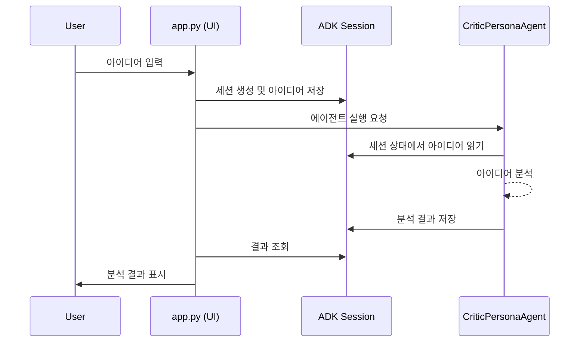
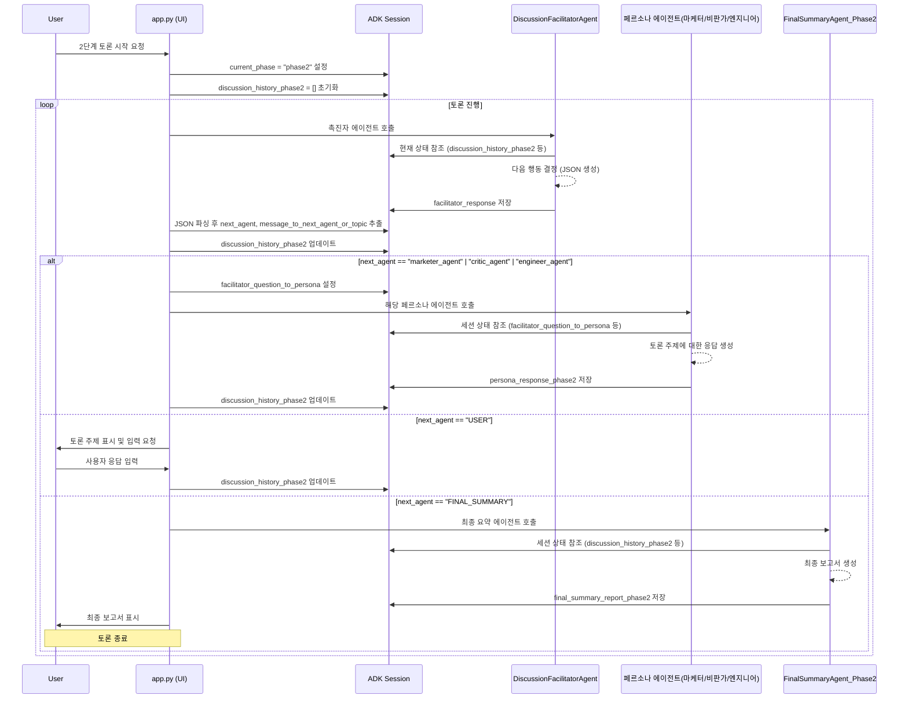

# AIdea Lab 아키텍처 설명서

## 프로젝트 구조

AIdea Lab은 다음과 같은 디렉토리 구조로 설계되었습니다:

```
aidea-lab/
│
├── src/                      # 소스 코드
│   ├── agents/               # AI 페르소나 에이전트 클래스
│   │   ├── critic_agent.py   # 비판적 분석가 페르소나 에이전트
│   │   ├── marketer_agent.py # 창의적 마케터 페르소나 에이전트
│   │   └── engineer_agent.py # 현실적 엔지니어 페르소나 에이전트
│   ├── orchestrator/         # 오케스트레이터 에이전트 클래스
│   │   └── main_orchestrator.py # 메인 오케스트레이터
│   ├── ui/                   # 사용자 인터페이스 코드
│   │   ├── app.py            # Streamlit 기반 UI 애플리케이션
│   │   ├── state_manager.py  # 세션 상태 관리 모듈
│   │   └── adk_controller.py # ADK 연동 로직 캡슐화 모듈
│   └── poc/                  # 개념 증명 (Proof of Concept) 코드
│       ├── simple_adk_agent.py      # 기본 ADK Agent 테스트
│       └── session_state_test_agent.py  # ADK session.state 테스트
│
├── config/                   # 설정 파일
│   ├── prompts.py            # 페르소나별 시스템 프롬프트 정의
│   ├── personas.py           # 페르소나 설정 및 매개변수 정의
│   └── models.py             # 제미니 모델 설정 및 선택 옵션 정의
│
├── tests/                    # 테스트 코드
│   ├── test_critic_agent.py  # 비판적 분석가 에이전트 테스트
│   └── test_app.py           # UI 애플리케이션 테스트
│
├── docs/                     # 문서
├── scripts/                  # 유틸리티 스크립트
└── .env                      # 환경 변수 설정 파일
```

## 핵심 구성 요소

### 1. config/prompts.py

이 파일은 다양한 AI 페르소나의 시스템 프롬프트를 정의합니다. 각 프롬프트는 해당 페르소나의 역할, 응답 스타일, 제공해야 할 정보를 상세히 설명합니다.

- **CRITIC_PROMPT**: 비판적 분석가 페르소나를 위한 시스템 프롬프트로, 아이디어의 문제점과 리스크를 분석합니다.
- **MARKETER_PROMPT**: 창의적 마케터 페르소나를 위한 시스템 프롬프트로, 아이디어의 창의적 가치와 시장 잠재력을 분석합니다.
- **ENGINEER_PROMPT**: 현실적 엔지니어 페르소나를 위한 시스템 프롬프트로, 아이디어의 기술적 실현 가능성을 분석합니다.
- **FINAL_SUMMARY_PROMPT**: 오케스트레이터가 최종 요약을 생성할 때 사용하는 프롬프트입니다.
- **DIALOGUE_SUMMARY_PROMPT**: (선택적) 대화 히스토리를 요약할 때 사용하는 프롬프트입니다.

### 2. config/personas.py

이 파일은 각 페르소나의 설정 및 매개변수를 정의합니다.

- **PersonaType**: 페르소나 유형을 정의하는 열거형 클래스입니다.
- **PERSONA_CONFIGS**: 각 페르소나별 구성 설정을 담고 있는 사전형 객체로, 이름, 설명, 아이콘, 온도(temperature), 최대 출력 토큰 수, 출력 키 등의 정보를 포함합니다.
- **ORCHESTRATOR_CONFIG**: 오케스트레이터 에이전트의 설정을 정의합니다.
- **PERSONA_SEQUENCE**: 워크숍 진행 순서를 정의하는 리스트입니다.
- **SELECTED_MODEL**: 현재 선택된 제미니 모델을 저장하는 전역 변수입니다. 기본값은 `DEFAULT_MODEL.value`로 설정되며, UI에서 모델 선택 시 이 값이 업데이트됩니다.

### 2-1. config/models.py

이 파일은 사용 가능한 제미니 모델과 모델 설정을 정의합니다.

- **역할**: 사용 가능한 제미니 모델과 모델 설정을 관리합니다.
- **아키텍처**:
    - `ModelType` Enum을 통해 사용 가능한 모델들의 ID 정의
    - `MODEL_CONFIGS` 사전을 통해 각 모델의 메타데이터(이름, 설명, 표시명) 관리
    - `DEFAULT_MODEL` 상수로 기본 모델 지정
    - `get_model_display_options()` 함수로 UI에 표시할 모델 옵션 목록 제공
    - 최신 제미니 모델 지원: Gemini 2.0 Flash, Gemini 2.5 Pro Preview 03-25, Gemini 2.5 Flash Preview 04-17, Gemini 2.5 Pro Preview 05-06

### 3. src/agents/critic_agent.py

비판적 분석가 페르소나 에이전트를 구현한 클래스 파일입니다. Google ADK의 Agent 클래스를 활용하여 비판적 분석가 역할을 수행하는 에이전트를 정의합니다.

- **CriticPersonaAgent 클래스**: 비판적 분석가 페르소나를 구현한 클래스입니다.
  - `__init__()`: 페르소나 설정과 프롬프트를 사용하여 에이전트를 초기화합니다.
  - `get_agent()`: 초기화된 Agent 객체를 반환합니다.
  - `get_output_key()`: 에이전트 응답이 세션 상태에 저장될 키를 반환합니다.

### 4. src/ui/state_manager.py

* **`state_manager.py`** *(1.1단계에서 새로 추가, 1.2단계에서 강화)*:
  * Streamlit 애플리케이션의 상태 관리를 전담하는 모듈
  * `AppStateManager` 클래스를 통해 모든 세션 상태 관리 기능을 캡슐화
  * 주요 구성 요소:
    - `SYSTEM_MESSAGES` 딕셔너리: 사용자 안내 메시지 템플릿 중앙화 관리
    - `AppStateManager` 클래스: 정적 메서드를 통한 일관된 상태 접근 인터페이스 제공
      - 1.1단계 메서드들:
        - `initialize_session_state()`: 세션 초기화 및 기본값 설정
        - `add_message()`, `show_system_message()`: 채팅 메시지 관리
        - `change_analysis_phase()`: 분석 단계 전환 관리
        - `submit_idea()`, `start_phase2_discussion()`: 사용자 액션 처리
        - `get_state()`, `set_state()`: 범용 상태 접근자
      - 1.2단계 추가 메서드들 (29개):
        - 세션 관리: `get_session_manager()`, `get_selected_model()`
        - 아이디어 관리: `get_current_idea()`, `set_current_idea()`, `get_analyzed_idea()`, `set_analyzed_idea()`
        - 분석 단계 관리: `get_analysis_phase()`, `get_adk_session_id()`, `set_adk_session_id()`
        - 사용자 정보 관리: `get_user_goal()`, `set_user_goal()`, `get_user_constraints()`, `set_user_constraints()`, `get_user_values()`, `set_user_values()`
        - UI 상태 관리: `get_messages()`, `get_show_additional_info()`, `get_expander_state()`
        - 2단계 토론 관리: `is_awaiting_user_input_phase2()`, `set_awaiting_user_input_phase2()`, `get_phase2_user_prompt()`, `set_phase2_user_prompt()` 등
        - 입력 값 접근: `get_input_value()` (Streamlit 위젯 값 안전 접근)
    - 호환성 전역 함수들: 기존 코드와의 호환성을 위한 래퍼 함수 제공
  * 장점:
    - 상태 관리 로직의 중앙화로 일관성 보장
    - `st.session_state` 접근의 완전한 캡슐화 (1.2단계)
    - 향후 상태 관리 기능 확장 시 유지보수성 향상
    - UI 로직과 상태 관리 로직의 명확한 분리
    - 상태 저장 방식 변경 시 유연성 확보

* **`adk_controller.py`** *(1.3단계에서 새로 추가)*:
  * Google ADK와의 연동 로직을 캡슐화하는 전담 모듈 (376줄)
  * `AdkController` 클래스를 통해 모든 ADK 상호작용을 중앙화
  * 주요 구성 요소:
    - `AdkController` 클래스: ADK 실행의 모든 세부사항 캡슐화
      - `__init__(session_manager)`: SessionManager 인스턴스를 의존성으로 받아 초기화
      - `execute_phase1_workflow()`: 1단계 분석 워크플로우 완전 관리
        * 오케스트레이터에서 출력 키 정보 가져오기
        * Runner 생성 및 이벤트 스트림 처리
        * 응답 검증 및 UI 메시지 구조 생성
      - `execute_phase2_facilitator()`: 2단계 토론 퍼실리테이터 실행
      - `execute_phase2_persona()`: 2단계 토론 페르소나 에이전트 실행
      - `_validate_agent_response()`: 응답 검증 및 대체 응답 생성
        * 기본 유효성 검사 (길이, 타입, 내용)
        * 요약 응답 형식 검증 (핵심 포인트, 종합 요약 포함 여부)
        * 실패 시 구조화된 대체 응답 자동 생성
      - `_process_response()`: 응답 처리 및 세션 상태 업데이트
      - `handle_adk_error()`: ADK 오류를 사용자 친화적 메시지로 변환
        * API 키, 네트워크, 할당량, 타임아웃 등 구체적 오류 유형별 처리
  * 아키텍처적 장점:
    - UI 코드(`app.py`)에서 약 200줄의 복잡한 ADK 로직 완전 제거
    - 응답 검증, 오류 처리, 이벤트 스트림 처리 등의 로직 완전 캡슐화
    - UI 코드가 ADK 실행의 세부사항을 직접 알 필요 없어짐
    - 모든 ADK 관련 상호작용이 단일 지점을 통해 중앙화됨
    - 향후 ADK 관련 기능 확장 및 유지보수 용이성 대폭 향상
    - 테스트 가능성 향상 (ADK 로직과 UI 로직의 완전한 분리)

* **`app.py`**: 
  * Streamlit 기반 사용자 인터페이스 제공
  * 챗봇 형태의 대화형 UI 구현
  * 아이디어 입력 및 분석 요청 처리
  * 세션 상태 관리 및 AI 페르소나 응답 표시
  * 시스템 안내 메시지 관리를 위한 `SYSTEM_MESSAGES` 정의 및 `show_system_message()` 함수 구현
  * 사용자 추가 정보(핵심 목표, 제약 조건, 중요 가치) 입력 및 관리
  * 비동기 분석 실행 및 스트리밍 응답 처리
  * *(1.3단계 수정사항)*: AdkController 사용으로 인한 대폭 간소화
    - 기존 `_run_phase1_analysis` 함수 완전 제거
    - `run_phase1_analysis_and_update_ui` 함수에서 AdkController 활용
    - ADK 오류 처리에서 AdkController의 `handle_adk_error` 메서드 사용
    - UI 로직과 ADK 로직의 완전한 분리 달성

### 5. src/poc/simple_adk_agent.py

Google ADK의 기본 Agent 클래스를 사용하여 간단한 LLM 에이전트를 구현한 예제 코드입니다. 환경 변수에서 API 키를 로드하고, Google ADK Runner 클래스를 사용하여 에이전트를 실행하고 응답을 처리합니다.
- **특징**: 선택 가능한 모델을 사용하도록 수정되어 `config/personas.py`의 `SELECTED_MODEL` 변수를 참조합니다.

### 6. src/poc/session_state_test_agent.py

Google ADK의 session.state 기능을 테스트하는 예제 코드입니다. 세션을 생성하고, session.state에 값을 저장한 후, 프롬프트 내에서 이 값을 참조하는 Agent를 실행합니다. 또한 Agent의 응답을 session.state에 저장하는 방법도 보여줍니다.
- **특징**: 선택 가능한 모델을 사용하도록 수정되어 `config/personas.py`의 `SELECTED_MODEL` 변수를 참조합니다.

### 7. tests/test_critic_agent.py

비판적 분석가 에이전트를 테스트하는 단위 테스트 파일입니다. 에이전트 초기화와 설정 값이 올바르게 적용되는지 검증합니다.

### 8. tests/test_app.py

UI 애플리케이션의 기능을 테스트하는 단위 테스트 파일입니다. 세션 생성, 아이디어 분석 등의 핵심 기능이 올바르게 동작하는지 검증합니다.

## 데이터 흐름 (Phase 1)

Phase 1에서 구현된 단일 페르소나 분석 워크플로우의 데이터 흐름은 다음과 같습니다:

1. **사용자 입력**: 사용자가 UI를 통해 아이디어를 입력합니다.
2. **세션 생성**: 새로운 ADK 세션이 생성되고, 사용자 아이디어가 `session.state["initial_idea"]`에 저장됩니다.
3. **에이전트 실행**: 비판적 분석가 에이전트가 세션 상태에서 아이디어를 읽고 분석합니다.
4. **결과 저장**: 분석 결과가 `session.state["critic_response"]`에 저장됩니다.
5. **결과 표시**: UI가 세션 상태에서 분석 결과를 읽어 사용자에게 표시합니다.



## Google ADK 에이전트 실행 아키텍처

Google ADK는 에이전트를 실행하기 위한 특정 패턴을 따르며, 이는 AIdea Lab 전체 아키텍처에 중요한 영향을 미칩니다:

### 1. 이벤트 루프 기반 아키텍처

Google ADK는 '이벤트 루프' 기반으로 동작합니다. 이는 에이전트 실행 흐름이 다음과 같은 패턴을 따름을 의미합니다:

1. **Runner**: 사용자 요청을 받아 Agent에 전달하고 이벤트를 처리하는 중앙 오케스트레이터 역할
2. **Agent**: 실제 로직을 수행하고 이벤트를 생성하는 실행 단위
3. **이벤트 순환**: Agent가 이벤트를 생성하면 Runner가 이를 처리하고, 다시 Agent에게 제어권을 돌려주는 방식

### 2. Runner 클래스

- **역할**: 에이전트 실행의 주요 진입점으로, 단일 사용자 쿼리에 대한 오케스트레이션 담당
- **주요 기능**:
  - 세션 관리 및 상태 저장
  - 이벤트 처리 및 전달
  - 에이전트 실행 관리

### 3. 세션 및 상태 관리

- **SessionService**: 세션 객체의 생성, 저장, 로드를 담당하는 서비스
- **Session**: 특정 대화에 대한 상태(state)와 이벤트 히스토리를 저장하는 컨테이너
- **State**: 대화 중 필요한 데이터를 저장하는 딕셔너리 형태의 객체

### 4. 표준 실행 패턴

```python
# 1. 세션 서비스 초기화
session_service = InMemorySessionService()

# 2. 세션 생성 또는 로드
session = session_service.create_session(
    app_name="앱_이름",
    user_id="사용자_ID",
    session_id="세션_ID"
)

# 3. Runner 인스턴스 생성
runner = Runner(
    agent=agent_instance,
    app_name="앱_이름",
    session_service=session_service
)

# 4. 입력 메시지 생성
content = types.Content(
    role="user",
    parts=[types.Part(text="사용자_메시지")]
)

# 5. Runner를 통한 에이전트 실행
events = runner.run(
    user_id="사용자_ID",
    session_id="세션_ID",
    new_message=content
)

# 6. 이벤트 처리 및 응답 추출
for event in events:
    if event.is_final_response() and event.content and event.content.parts:
        response_text = event.content.parts[0].text
        break
```

## 기술 스택

- **Google ADK**: AI 에이전트 개발 및 오케스트레이션을 위한 프레임워크
- **Gemini API**: LLM 서비스로 활용
- **Python**: 전체 프로젝트의 기본 프로그래밍 언어
- **Streamlit**: 사용자 인터페이스 구현을 위한 프레임워크
- **python-dotenv**: 환경 변수 관리
- **pytest**: 단위 테스트 구현

## 데이터 흐름

1. 사용자가 UI를 통해 아이디어를 입력합니다.
2. 입력된 아이디어는 session.state에 저장됩니다.
3. 오케스트레이터 에이전트가 페르소나 순서에 따라 각 페르소나 에이전트를 순차적으로 실행합니다.
4. 각 페르소나 에이전트는 아이디어와 이전 페르소나의 의견을 분석하여 결과를 생성합니다.
5. 각 페르소나의 분석 결과는 session.state에 저장됩니다.
6. 모든 페르소나 분석이 완료되면, 오케스트레이터가 최종 요약을 생성합니다.
7. 최종 요약은 UI에 표시됩니다.

## 확장성

AIdea Lab의 아키텍처는 다음과 같은 확장을 고려하여 설계되었습니다:

1. **새로운 페르소나 추가**: 추가 페르소나를 구현하려면 프롬프트를 정의하고 페르소나 설정을 추가한 후, 해당 페르소나 에이전트를 구현하면 됩니다.
2. **외부 도구 통합**: Google ADK의 도구(Tool) 메커니즘을 활용하여 외부 데이터 소스나 API와의 통합을 추가할 수 있습니다.
3. **다양한 UI 옵션**: Streamlit 외에도 다양한 UI 프레임워크(예: Gradio, Flask+React)로 전환할 수 있는 구조입니다.

## Phase 1 구현에서의 아키텍처 핵심 요소

### 모듈 분리와 단일 책임 원칙

각 파일은 명확한 단일 책임을 가지도록 설계했습니다:
- `critic_agent.py`: 비판적 분석가 페르소나의 동작만 담당
- `app.py`: 사용자 인터페이스와 인터랙션만 담당

### Session State의 활용

ADK의 `session.state`는 에이전트 간의 데이터 공유를 위한 핵심 메커니즘입니다:

1. **입력 전달**: 사용자 아이디어를 `initial_idea` 키로 저장
2. **출력 저장**: 에이전트의 분석 결과를 `critic_response` 키로 저장
3. **상태 유지**: 여러 차례의 에이전트 호출 사이에 상태 유지

### 확장 가능한 디자인

Phase 1에서는 단일 페르소나 에이전트만 구현했지만, 다중 페르소나 지원을 위한 기반을 마련했습니다:

1. **공통 인터페이스**: 모든 페르소나 에이전트가 동일한 인터페이스를 갖도록 설계 (`get_agent()`, `get_output_key()`)
2. **설정 기반 초기화**: 설정 파일에서 페르소나 매개변수를 로드하는 방식으로, 새 페르소나 추가 시 코드 변경을 최소화

이러한 아키텍처 설계를 통해 Phase 2에서 추가적인 페르소나와 오케스트레이션 로직을 쉽게 통합할 수 있습니다.

## 파일별 역할 및 아키텍처 설명

### 핵심 구성 요소

#### 에이전트 모듈 (`src/agents/`)

* **`critic_agent.py`**: 
  * 비판적 분석가 페르소나 에이전트 구현
  * `CriticPersonaAgent` 클래스를 통해 구현, 아이디어의 잠재적 문제점과 리스크를 분석
  * `CRITIC_PROMPT`를 시스템 프롬프트로 사용하여 Google ADK `Agent` 객체 생성
  * `get_agent()` 및 `get_output_key()` 메서드 제공하여 에이전트 객체와 결과 저장 키 접근 지원

* **`marketer_agent.py`**: 
  * 창의적 마케터 페르소나 에이전트 구현
  * `MarketerPersonaAgent` 클래스 통해 구현, 아이디어의 창의적 가치와 시장 잠재력 분석
  * `MARKETER_PROMPT`를 시스템 프롬프트로 사용
  * 다른 에이전트들과 동일한 인터페이스 제공으로 일관된 접근 방식 유지

* **`engineer_agent.py`**: 
  * 현실적 엔지니어 페르소나 에이전트 구현
  * `EngineerPersonaAgent` 클래스 통해 구현, 아이디어의 기술적 실현 가능성 평가
  * `ENGINEER_PROMPT`를 시스템 프롬프트로 사용
  * 모델 이름을 파라미터로 받아 다양한 LLM 모델 지원

#### 오케스트레이터 모듈 (`src/orchestrator/`)

* **`main_orchestrator.py`**: 
  * 다양한 페르소나 에이전트의 실행 조율 담당
  * `AIdeaLabOrchestrator` 클래스가 핵심 로직 제공
  * 페르소나 에이전트 생성 및 관리
  * Google ADK `SequentialAgent`를 사용한 워크플로우 에이전트 구성
  * `get_workflow_agent()`, `get_phase1_workflow()` 등 워크플로우 에이전트 접근 메서드 제공
  * `get_output_keys()` 메서드를 통해 모든 에이전트의 결과 저장 키 목록 제공

#### UI 모듈 (`src/ui/`)

* **`state_manager.py`** *(1.1단계에서 새로 추가, 1.2단계에서 강화)*:
  * Streamlit 애플리케이션의 상태 관리를 전담하는 모듈
  * `AppStateManager` 클래스를 통해 모든 세션 상태 관리 기능을 캡슐화
  * 주요 구성 요소:
    - `SYSTEM_MESSAGES` 딕셔너리: 사용자 안내 메시지 템플릿 중앙화 관리
    - `AppStateManager` 클래스: 정적 메서드를 통한 일관된 상태 접근 인터페이스 제공
      - 1.1단계 메서드들:
        - `initialize_session_state()`: 세션 초기화 및 기본값 설정
        - `add_message()`, `show_system_message()`: 채팅 메시지 관리
        - `change_analysis_phase()`: 분석 단계 전환 관리
        - `submit_idea()`, `start_phase2_discussion()`: 사용자 액션 처리
        - `get_state()`, `set_state()`: 범용 상태 접근자
      - 1.2단계 추가 메서드들 (29개):
        - 세션 관리: `get_session_manager()`, `get_selected_model()`
        - 아이디어 관리: `get_current_idea()`, `set_current_idea()`, `get_analyzed_idea()`, `set_analyzed_idea()`
        - 분석 단계 관리: `get_analysis_phase()`, `get_adk_session_id()`, `set_adk_session_id()`
        - 사용자 정보 관리: `get_user_goal()`, `set_user_goal()`, `get_user_constraints()`, `set_user_constraints()`, `get_user_values()`, `set_user_values()`
        - UI 상태 관리: `get_messages()`, `get_show_additional_info()`, `get_expander_state()`
        - 2단계 토론 관리: `is_awaiting_user_input_phase2()`, `set_awaiting_user_input_phase2()`, `get_phase2_user_prompt()`, `set_phase2_user_prompt()` 등
        - 입력 값 접근: `get_input_value()` (Streamlit 위젯 값 안전 접근)
    - 호환성 전역 함수들: 기존 코드와의 호환성을 위한 래퍼 함수 제공
  * 장점:
    - 상태 관리 로직의 중앙화로 일관성 보장
    - `st.session_state` 접근의 완전한 캡슐화 (1.2단계)
    - 향후 상태 관리 기능 확장 시 유지보수성 향상
    - UI 로직과 상태 관리 로직의 명확한 분리
    - 상태 저장 방식 변경 시 유연성 확보

* **`adk_controller.py`** *(1.3단계에서 새로 추가)*:
  * Google ADK와의 연동 로직을 캡슐화하는 전담 모듈 (376줄)
  * `AdkController` 클래스를 통해 모든 ADK 상호작용을 중앙화
  * 주요 구성 요소:
    - `AdkController` 클래스: ADK 실행의 모든 세부사항 캡슐화
      - `__init__(session_manager)`: SessionManager 인스턴스를 의존성으로 받아 초기화
      - `execute_phase1_workflow()`: 1단계 분석 워크플로우 완전 관리
        * 오케스트레이터에서 출력 키 정보 가져오기
        * Runner 생성 및 이벤트 스트림 처리
        * 응답 검증 및 UI 메시지 구조 생성
      - `execute_phase2_facilitator()`: 2단계 토론 퍼실리테이터 실행
      - `execute_phase2_persona()`: 2단계 토론 페르소나 에이전트 실행
      - `_validate_agent_response()`: 응답 검증 및 대체 응답 생성
        * 기본 유효성 검사 (길이, 타입, 내용)
        * 요약 응답 형식 검증 (핵심 포인트, 종합 요약 포함 여부)
        * 실패 시 구조화된 대체 응답 자동 생성
      - `_process_response()`: 응답 처리 및 세션 상태 업데이트
      - `handle_adk_error()`: ADK 오류를 사용자 친화적 메시지로 변환
        * API 키, 네트워크, 할당량, 타임아웃 등 구체적 오류 유형별 처리
  * 아키텍처적 장점:
    - UI 코드(`app.py`)에서 약 200줄의 복잡한 ADK 로직 완전 제거
    - 응답 검증, 오류 처리, 이벤트 스트림 처리 등의 로직 완전 캡슐화
    - UI 코드가 ADK 실행의 세부사항을 직접 알 필요 없어짐
    - 모든 ADK 관련 상호작용이 단일 지점을 통해 중앙화됨
    - 향후 ADK 관련 기능 확장 및 유지보수 용이성 대폭 향상
    - 테스트 가능성 향상 (ADK 로직과 UI 로직의 완전한 분리)

* **`app.py`**: 
  * Streamlit 기반 사용자 인터페이스 제공
  * 챗봇 형태의 대화형 UI 구현
  * 아이디어 입력 및 분석 요청 처리
  * 세션 상태 관리 및 AI 페르소나 응답 표시
  * 시스템 안내 메시지 관리를 위한 `SYSTEM_MESSAGES` 정의 및 `show_system_message()` 함수 구현
  * 사용자 추가 정보(핵심 목표, 제약 조건, 중요 가치) 입력 및 관리
  * 비동기 분석 실행 및 스트리밍 응답 처리
  * *(1.3단계 수정사항)*: AdkController 사용으로 인한 대폭 간소화
    - 기존 `_run_phase1_analysis` 함수 완전 제거
    - `run_phase1_analysis_and_update_ui` 함수에서 AdkController 활용
    - ADK 오류 처리에서 AdkController의 `handle_adk_error` 메서드 사용
    - UI 로직과 ADK 로직의 완전한 분리 달성

#### 설정 모듈 (`config/`)

* **`prompts.py`**: 
  * 각 페르소나별 시스템 프롬프트 정의
  * 비판적 분석가(`CRITIC_PROMPT`), 창의적 마케터(`MARKETER_PROMPT`), 현실적 엔지니어(`ENGINEER_PROMPT`)의 지침 설정
  * 오케스트레이터 및 요약 생성을 위한 프롬프트(`ORCHESTRATOR_PROMPT`, `FINAL_SUMMARY_PROMPT`) 제공

* **`personas.py`**: 
  * 페르소나 유형(`PersonaType`) 및 설정(`PERSONA_CONFIGS`) 정의
  * 페르소나별 매개변수(temperature, 토큰 제한 등) 구성
  * 워크숍 진행 순서 정의(`PERSONA_SEQUENCE`)
  * 오케스트레이터 설정(`ORCHESTRATOR_CONFIG`) 제공

* **`models.py`**: 
  * 사용 가능한 제미니 모델 정의
  * `ModelType` 열거형으로 지원 모델 정의
  * 각 모델에 대한 설명 및 표시 이름 제공
  * UI에서 모델 선택 옵션을 위한 `get_model_display_options()` 함수 제공

### 데이터 흐름

1. **사용자 입력 처리**: 
   * `app.py`에서 사용자의 아이디어와 추가 정보(목표, 제약 조건, 가치) 입력 받음
   * Streamlit 세션 상태(`st.session_state`)에 저장

2. **ADK 세션 관리**:
   * `InMemorySessionService`를 통한 ADK 세션 생성
   * 사용자 입력을 ADK `session.state`에 저장
   * 여러 페르소나 에이전트 간 정보 공유에 활용

3. **워크플로우 실행**:
   * `AIdeaLabOrchestrator`가 `SequentialAgent` 기반 워크플로우 구성
   * 모든 페르소나 에이전트를 순차적으로 실행
   * 각 에이전트의 결과를 ADK `session.state`에 저장
   * 최종적으로 요약 에이전트가 전체 결과 종합

4. **UI 업데이트**:
   * ADK 이벤트 스트림을 통한 응답 처리
   * 각 페르소나의 결과를 순차적으로 UI에 스트리밍 표시
   * 시스템 안내 메시지를 통한 분석 흐름 안내

### 주요 상호작용

1. **에이전트-오케스트레이터 상호작용**:
   * 오케스트레이터가 페르소나 에이전트 객체 생성 및 관리
   * `SequentialAgent`를 통한 순차적 실행 조율
   * `session.state`를 통한 정보 공유

2. **오케스트레이터-UI 상호작용**:
   * UI가 오케스트레이터 메서드 호출하여 워크플로우 에이전트 획득
   * `Runner`를 통한 워크플로우 실행
   * 이벤트 스트림 기반 비동기 결과 처리

3. **설정-에이전트 상호작용**:
   * 에이전트 클래스가 설정 모듈에서 프롬프트 및 페르소나 설정 참조
   * 모델 설정을 통한 LLM 선택 적용

이러한 아키텍처는 모듈화, 확장성, 재사용성을 중심으로 설계되어 있으며, Google ADK의 에이전트 및 세션 관리 기능을 효과적으로 활용하고 있습니다. 사용자 경험 측면에서는 Streamlit의 채팅 인터페이스와 비동기 처리를 통해 자연스러운 대화형 분석 경험을 제공합니다.

## Phase 2 토론 아키텍처

### 9. src/agents/facilitator_agent.py

토론 퍼실리테이터 에이전트를 구현한 클래스 파일입니다. Google ADK의 Agent 클래스를 기반으로 토론을 주도하고 다음 발언자를 결정하는 역할을 담당합니다.

- **역할**: 2단계 토론을 조율하고 다음 발언자를 결정하는 퍼실리테이터 역할을 수행합니다.
- **아키텍처**:
  - `DiscussionFacilitatorAgent` 클래스: 토론 퍼실리테이터 역할을 담당하는 클래스
    - `__init__()`: 모델 이름과 동적 프롬프트 생성 함수를 인자로 받아 에이전트 초기화
    - `get_agent()`: 초기화된 Agent 객체 반환
    - `get_output_key()`: 에이전트 응답이 세션 상태에 저장될 키 반환 (facilitator_response)
  - **핵심 기능**: JSON 형식의 출력을 생성하여 다음 단계를 결정하는 라우팅 메커니즘 제공
    - `next_agent`: 다음 발언할 에이전트 ("marketer_agent", "critic_agent", "engineer_agent", "USER", "FINAL_SUMMARY")
    - `message_to_next_agent_or_topic`: 다음 에이전트에게 전달할 질문 또는 토론 주제
    - `reasoning`: 해당 에이전트/주제를 선택한 이유 설명

### 10. config/prompts.py 2단계 관련 함수

config/prompts.py 파일에 추가된 2단계 토론 관련 동적 프롬프트 제공자 함수들입니다.

- **FACILITATOR_PHASE2_PROMPT_PROVIDER**: 토론 퍼실리테이터를 위한 동적 프롬프트 생성 함수
  - **역할**: ReadonlyContext를 인자로 받아 현재 세션 상태에 맞게 퍼실리테이터 프롬프트를 동적으로 생성
  - **주요 기능**: 
    - 세션 상태에서 아이디어, 사용자 정보, 1단계 결과, 토론 히스토리 등을 가져와 프롬프트에 통합
    - 토론 진행 상황(발언자 이력)에 따른 맞춤형 안내 제공
    - 토론 지속 여부(종료 조건)에 대한 가이드라인 제공
    - JSON 응답 형식 및 필수 필드 상세 정의

- **MARKETER_PHASE2_PROMPT_PROVIDER**: 창의적 마케터를 위한 2단계 토론용 동적 프롬프트 생성 함수
  - **역할**: ReadonlyContext를 인자로 받아 현재 세션 상태와 촉진자의 질문에 맞게 마케터 프롬프트 생성
  - **주요 기능**: 
    - 다른 페르소나의 1단계 의견을 참조하여 토론 맥락 제공
    - 촉진자의 질문에 직접 응답하도록 유도
    - 시장 가치와 차별화 전략에 집중하면서 아이디어 발전 방안 제시
    - 사용자 목표와의 연결성 강조

- **CRITIC_PHASE2_PROMPT_PROVIDER**: 비판적 분석가를 위한 2단계 토론용 동적 프롬프트 생성 함수
  - **역할**: ReadonlyContext를 인자로 받아 현재 세션 상태와 촉진자의 질문에 맞게 비판적 분석가 프롬프트 생성
  - **주요 기능**: 
    - 논리적 분석과 핵심 리스크 평가 수행
    - 단순 비판을 넘어 문제점 극복 방안까지 제시하도록 유도
    - 사용자 제약조건을 기반으로 아이디어의 실현 가능성 평가
    - 가정 검증을 위한 구체적인 방법 제안

- **ENGINEER_PHASE2_PROMPT_PROVIDER**: 현실적 엔지니어를 위한 2단계 토론용 동적 프롬프트 생성 함수
  - **역할**: ReadonlyContext를 인자로 받아 현재 세션 상태와 촉진자의 질문에 맞게 엔지니어 프롬프트 생성
  - **주요 기능**: 
    - 기술적 실현 방안과 단계적 구현 전략 제시
    - 사용자 중요 가치를 실현하는 기술적 접근 방식 설명
    - 기술적 트레이드오프를 비교하여 최적의 구현 방안 추천
    - MVP와 이후 확장 단계를 명확히 구분하도록 유도

- **FINAL_SUMMARY_PHASE2_PROMPT_PROVIDER**: 2단계 토론 최종 요약을 위한 동적 프롬프트 생성 함수
  - **역할**: ReadonlyContext를 인자로 받아 1단계 결과와 2단계 토론 내용을 종합하는 최종 요약 프롬프트 생성
  - **주요 기능**: 
    - 토론 히스토리를 컨텍스트 크기에 맞게 처리하여 길이 제한 관리
    - 최종 아이디어 설명, 주요 변경 사항, 핵심 장점, 리스크 및 완화 방안, 실행 단계 등 구조화된 보고서 요청
    - 모든 세션 상태 정보를 종합적으로 활용하여 완전한 컨텍스트 제공

### 11. src/orchestrator/main_orchestrator.py 2단계 관련 메서드

AIdeaLabOrchestrator 클래스에 추가된 2단계 토론 관련 메서드들입니다.

- **get_phase2_discussion_facilitator()**: 토론 퍼실리테이터 에이전트를 생성하고 반환하는 메서드
  - **역할**: 2단계 토론을 조율할 퍼실리테이터 에이전트 인스턴스 생성
  - **동작**: `DiscussionFacilitatorAgent` 클래스 인스턴스를 생성하고 `FACILITATOR_PHASE2_PROMPT_PROVIDER` 함수를 instruction으로 전달

- **get_phase2_persona_agent(persona_type)**: 특정 페르소나의 2단계 토론용 에이전트를 생성하고 반환하는 메서드
  - **역할**: 2단계 토론에 참여할 페르소나 에이전트를 동적 프롬프트 제공자 함수와 함께 생성
  - **동작**: 페르소나 유형(MARKETER, CRITIC, ENGINEER)에 따라 해당 2단계 프롬프트 제공자 함수를 사용하여 에이전트 생성

- **get_phase2_final_summary_agent()**: 2단계 토론 최종 요약 에이전트를 생성하고 반환하는 메서드
  - **역할**: 2단계 토론이 종료된 후 최종 요약 에이전트를 생성
  - **동작**: `FINAL_SUMMARY_PHASE2_PROMPT_PROVIDER` 함수를 instruction으로 사용하여 최종 요약 에이전트 생성

## Phase 2 데이터 흐름

2단계 토론 기능의 데이터 흐름은 다음과 같습니다:

1. **토론 초기화**: 사용자가 1단계 분석을 완료하고 2단계 토론을 시작하면, ADK 세션의 `state["current_phase"]`가 "phase2"로 설정되고 `state["discussion_history_phase2"]`가 초기화됩니다.

2. **퍼실리테이터 응답 처리**:
   - 퍼실리테이터 에이전트가 호출되어 다음 발언자와 토론 주제를 결정합니다.
   - 퍼실리테이터의 응답이 `state["facilitator_response"]`에 저장되고, 이 응답에서 JSON 부분을 파싱하여 `next_agent`와 `message_to_next_agent_or_topic`을 추출합니다.
   - 퍼실리테이터의 응답과 결정이 `state["discussion_history_phase2"]`에 기록됩니다.

3. **페르소나 에이전트 호출**:
   - `next_agent`가 특정 페르소나(marketer_agent, critic_agent, engineer_agent)를 지정한 경우, 해당 페르소나 에이전트가 호출됩니다.
   - 발언에 앞서 `state["facilitator_question_to_persona"]`에 `message_to_next_agent_or_topic`가 저장됩니다.
   - 페르소나 에이전트는 2단계용 동적 프롬프트를 통해 현재 세션 상태와 퍼실리테이터의 질문을 참조하여 응답을 생성합니다.
   - 페르소나의 응답이 `state["{persona}_response_phase2"]`에 저장되고, `state["discussion_history_phase2"]`에 기록됩니다.

4. **사용자 참여 처리**:
   - `next_agent`가 "USER"인 경우, 사용자에게 `message_to_next_agent_or_topic`가 표시되고 입력을 받습니다.
   - 사용자의 응답이 `state["discussion_history_phase2"]`에 기록됩니다.

5. **토론 종료 처리**:
   - `next_agent`가 "FINAL_SUMMARY"인 경우, 토론이 종료되고 최종 요약 에이전트가 호출됩니다.
   - 최종 요약 에이전트는 전체 토론 내용을 종합하여 구조화된 최종 보고서를 생성합니다.
   - 최종 보고서가 `state["final_summary_report_phase2"]`에 저장되고 UI에 표시됩니다.



위 다이어그램은 2단계 토론의 전체 데이터 흐름과 상호작용을 보여줍니다. 퍼실리테이터 에이전트가 토론의 방향을 안내하고, 페르소나 에이전트들이 각자의 전문성을 바탕으로 토론에 참여하며, 사용자도 필요시 토론에 개입할 수 있습니다. 충분한 토론 후에는 최종 요약 에이전트가 전체 내용을 종합하여 최종 보고서를 생성합니다.

### 12. src/ui/app.py 2단계 토론 UI 연동

2단계 토론 흐름 제어 및 UI 연동을 담당하는 함수들입니다.

- **handle_phase2_discussion()**: 2단계 토론 처리 함수
  - **역할**: 사용자가 '2단계 토론 시작하기'를 선택했을 때 토론 프로세스를 시작하고 조율
  - **동작**: 세션 상태 확인, 오케스트레이터 생성, 사용자 입력 처리, 토론 실행 및 상태 관리

- **_run_phase2_discussion(session_id_string, orchestrator)**: 내부 비동기 토론 실행 함수
  - **역할**: 토론 퍼실리테이터와 페르소나 에이전트들 간의 대화를 비동기적으로 실행하고 UI에 표시
  - **동작**: 
    - 퍼실리테이터 에이전트 응답 처리 및 JSON 파싱
    - `next_agent` 값에 따른 라우팅 처리
    - 페르소나 에이전트 호출 및 응답 처리
    - 사용자 입력 요청 및 처리
    - 최종 요약 생성 및 표시

- **main()** 함수 내 상태 처리 코드:
  - `phase2_pending_start`: 2단계 토론 준비 상태
  - `phase2_running`: 토론 진행 중 상태
  - `phase2_user_input`: 사용자 입력 대기 상태
  - `phase2_complete`: 토론 완료 상태
  - `phase2_error`: 토론 중 오류 발생 상태

### 2단계 토론을 위한 Streamlit 세션 상태 변수

- **awaiting_user_input_phase2**: 사용자 입력을 기다리는 상태 플래그
- **phase2_user_prompt**: 사용자에게 표시할 질문 또는 프롬프트
- **phase2_user_response**: 사용자가 입력한 응답
- **phase2_discussion_complete**: 토론 종료 플래그
- **phase2_summary_complete**: 최종 요약 완료 플래그

### 2단계 토론 흐름의 기술적 구현

1. **토론 초기화**:
   - `transition_to_phase2()` 메서드를 통해 ADK 세션의 `current_phase`를 "phase2"로 설정
   - `discussion_history_phase2` 배열 초기화

2. **퍼실리테이터 응답 처리**:
   - 빈 메시지로 퍼실리테이터 에이전트 실행 (세션 상태를 직접 참조)
   - 응답에서 정규 표현식으로 JSON 부분 추출 및 파싱
   - `next_agent`와 `message_to_next_agent_or_topic` 값 추출
   - 퍼실리테이터의 응답과 결정이 `state["discussion_history_phase2"]`에 기록됩니다.

3. **라우팅 처리**:
   - **페르소나 에이전트 호출 시**:
     - `facilitator_question_to_persona`에 질문 설정
     - `persona_type_map`을 사용하여 페르소나 유형 결정
     - `get_phase2_persona_agent()`로 해당 페르소나 에이전트 생성
     - 페르소나 응답을 UI에 표시하고 토론 히스토리에 추가
   
   - **사용자 참여 요청 시**:
     - Streamlit 세션 상태 변수 설정 (`awaiting_user_input_phase2`, `phase2_user_prompt`)
     - UI에 사용자 입력 필드 표시
     - 사용자 응답을 토론 히스토리에 추가하고 토론 재개
   
   - **최종 요약 요청 시**:
     - `get_phase2_final_summary_agent()`로 최종 요약 에이전트 생성
     - 요약 결과를 UI에 표시하고 토론 종료

4. **UI 상태 관리**:
   - 각 분석 단계에 맞는 UI 컴포넌트 표시
   - 사용자 입력 처리를 위한 조건부 로직
   - 토론 진행 상황에 따른 스피너, 정보 메시지 표시
   - 토론 완료 후 새 아이디어 분석 옵션 제공

이 구현은 Google ADK의 세션 관리 및 에이전트 실행 기능과 Streamlit의 UI 컴포넌트를 효과적으로 통합하여, 사용자와 AI 페르소나 간의 매끄러운 토론 경험을 제공합니다. 또한 비동기 처리를 통해 긴 응답 생성 시간에도 UI 반응성을 유지합니다.
